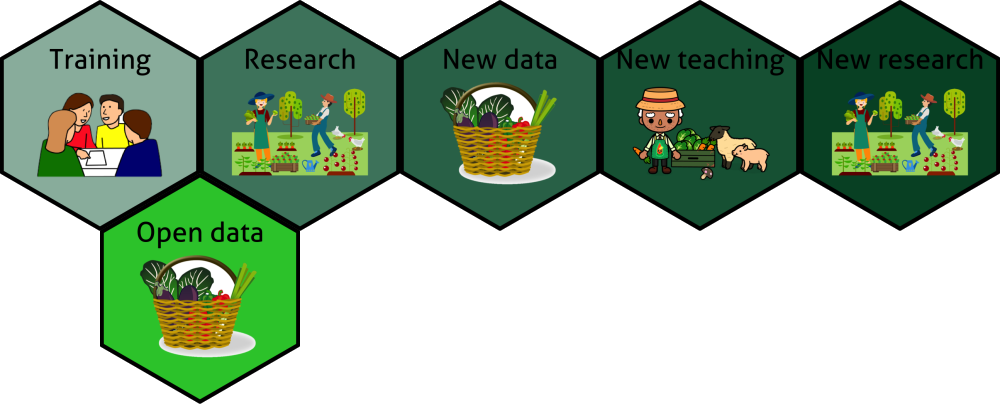

# Open Data

### [journey since 2016]()

 

Dr Ning Lu

Senior Research Fellow [@ActEarly]()

---

<!-- .slide: data-background="default-thumbnail.jpg" -->

## Open data value chain

---

<!-- .slide: data-transition="slide" data-background="#C41230" data-background-transition="zoom" -->

## Open Data in training

- [ ] Flower (iris), Penguin
- [ ] New York taxi
- [ ] Muffin and chihuahua
- [ ] GDP
- [x] Local COVID-19

_Which one is more relevant for Bradford, Leeds, or York?_

---

<!-- .slide: data-transition="slide" data-background="#00502F" data-background-transition="zoom" -->

## Data Hero 1.0

(2020)

Using open data and dissertation to do something meaningful

- [x] Local hospitality business survival
- [x] Crime and metal health
- [x] Gender inequality in entrepreneurship
- [x] Council spending audit
- [x] Student accomdation choice

---

<!-- .slide: data-transition="slide" data-background="#00000" data-background-transition="zoom" -->

### What I have learned

- [x] Relevance and attachment

- [x] Transferrable skill / Good grades

- [x] Project continuity

- [x] More people working on "service improvement"

- [x] Data Hero 2.0 is coming

---

<!-- .slide: data-transition="slide" data-background="#C41230" data-background-transition="zoom" -->

## Open Data in research

 

### [School admission in Bradford]()

---

<!-- .slide: data-transition="slide" data-background="#00502F" data-background-transition="zoom" -->

|       | Gated data | Open data |
| ----- | :--------: | :-------: |
| Level | Individual |  School   |

| Time | 1 Year | 5 years |

| Subject | Preference | Applied/Accepted |

| Dimensions | Up to 10 | 30+ |

| Extraction | Meeting + Emails + Onsite | Scraping + Automation

| Accessibility | Low | High |

| Teaching | No | Yes |

---

### What I have learned?

- [x] Improve gated data: context, linkage, measurement

- [x] Project continuity

- [x] Feed into the next cycle of training

---

<!-- .slide: style="text-align: left;" -->

## Holme Wood Data Science Repository

[holmewood.netlify.app](holmewood.netlify.app)
